# CarCar
Working Name CarCar is an application for managing the logistics of a car dealership. Inventory, sales, and services are managed within this application.


Team:

Hung Hoang - Automobile Service
Phil Sobrepena - Automobile Sales

## Diagram & Design

CarCar is an application that contains 3 microservices that integrate with each other.

Inventory | Services | Sales

Below is a diagram of their relationship to one another.

 *******************

 ********************


## Service microservice

Explain your models and integration with the inventory
microservice, here.

Approach: I will create the django models in service_rest, create the necessary Value Objects (VO)
Services interacts with the inventory microservice and database to populate the web page with relevant data. This includes appointments, technicians, and  Automobile/VIN data.
Within this microservice you can create,read/get, update, and delete technicians and appointments.

## Sales microservice

The sales microservice models are defined as follows:

AutomobileVO:
    A value object that uses a poller to get data from the Automobile object in Inventory.

SalesPerson:
    contains first_name, last_name, and employee_id traits.

Customer:
    contains first_name, last_name, address, and phone_number traits.
Sale:
    contains automobile, salesperson, customer, and price traits.

The Sales Microservice requires integration with the Inventory in order to properly receive automobile information when making a sale. When a sale is made, the automobile instance is updated with a put request to change the value sold=True.


## Integration
Our 3 microservices work together to make our application work.
The inventory domain keeps a record in the database of all automobiles(along with their relevant information) that are for sale. Sales and services use this data from inventory using a poller, which communicates with inventory in order to ensure all information is updated regularly.

## How to Run this App
To run this application, fork and clone the repository at:

https://gitlab.com/hungdh17/project-beta

Then execute the following commands to build and run the project:

 - docker volume create beta-data
 - docker compose build
 - docker compose up

 Once containers are running the project can be viewed at:

 http://localhost:3000/

## API Documentation

### URLs and Ports

The application uses the following URLs for the front end:

CarCar Home Page:
http://localhost:3000/

---**INVENTORY URLS**---

Manufacturer List:
http://localhost:3000/manufacturers

Create a Manufacturer:
http://localhost:3000/manufacturers/create

Models List:
http://localhost:3000/models

Create a Model:
http://localhost:3000/models/create

Automobiles List:
http://localhost:3000/automobiles

Create an Automobile:
http://localhost:3000/automobiles/create

---**SERVICES URLS**---

Technicians List:
http://localhost:3000/technicians/

Create a Technician:
http://localhost:3000/technicians/create

Appointments List:
http://localhost:3000/appointments

Create an Appointment:
http://localhost:3000/appointments/create

Appointment History:
http://localhost:3000/appointments/history

---**SALES URLS**---

Customers List:
http://localhost:3000/customers

Create a Customer:
http://localhost:3000/customers/create

Salespeople List:
http://localhost:3000/salespeople

Create a Salesperson:
http://localhost:3000/salespeople/create

Sales List:
http://localhost:3000/sales

Sales by Salesperson List:
http://localhost:3000/sales/salesperson

Create a Sale:
http://localhost:3000/sales/create


----**PORTS**----

the following ports are referenced throughout this document, but are referenced again here for convenience.

---MANUFACTURERS---

List manufacturers	            GET	    http://localhost:8100/api/manufacturers/
Create a manufacturer	        POST    http://localhost:8100/api/manufacturers/
Get a specific manufacturer	    GET	    http://localhost:8100/api/manufacturers/:id/
Update a specific manufacturer	PUT	    http://localhost:8100/api/manufacturers/:id/
Delete a specific manufacturer	DELETE	http://localhost:8100/api/manufacturers/:id/

---VEHICLES---

List vehicle models	            GET     http://localhost:8100/api/models/
Create a vehicle model	        POST	http://localhost:8100/api/models/
Get a specific vehicle model	GET	    http://localhost:8100/api/models/:id/
Update a specific vehicle model	PUT	    http://localhost:8100/api/models/:id/
Delete a specific vehicle model	DELETE	http://localhost:8100/api/models/:id/

---AUTOMOBILES---

List automobiles	            GET 	http://localhost:8100/api/automobiles/
Create an automobile	        POST	http://localhost:8100/api/automobiles/
Get a specific automobile	    GET	    http://localhost:8100/api/automobiles/:vin/
Update a specific automobile	PUT	    http://localhost:8100/api/automobiles/:vin/
Delete a specific automobile	DELETE	http://localhost:8100/api/automobiles/:vin/

---TECHNICIANS---

List technicians	                    GET	    http://localhost:8080/api/technicians/
Create a technician	                    POST	http://localhost:8080/api/technicians/
Delete a specific technician	        DELETE	http://localhost:8080/api/technicians/:id/
List appointments	                    GET	    http://localhost:8080/api/appointments/
Create an appointment	                POST	http://localhost:8080/api/appointments/
Delete an appointment	                DELETE	http://localhost:8080/api/appointments/:id/
Set appointment status to "canceled"	PUT	    http://localhost:8080/api/appointments/:id/cancel/
Set appointment status to "finished"	PUT	    http://localhost:8080/api/appointments/:id/finish/

---AUTOMOBILES---

List salespeople	            GET	    http://localhost:8090/api/salespeople/
Create a salesperson	        POST	http://localhost:8090/api/salespeople/
Delete a specific salesperson	DELETE	http://localhost:8090/api/salespeople/:id/
List customers	                GET	    http://localhost:8090/api/customers/
Create a customer	            POST	http://localhost:8090/api/customers/
Delete a specific customer	    DELETE	http://localhost:8090/api/customers/:id/
List sales	                    GET	    http://localhost:8090/api/sales/
Create a sale	                POST	http://localhost:8090/api/sales/
Delete a sale	                DELETE	http://localhost:8090/api/sales/:id/


### Inventory API (Optional)

The Inventory API contains 3 Models which are used by both Services and Sales APIs

The models are as follows:

Manufacturer:
    Contains the name trait for the manufacturer.

VehicleModel
    Contains the name, picture_url, and manufacturer foreignkey traits pertaining to a specific Vehicle

Automobiles
    Contains the color, year, vin, sold, and model (foreignkey) traits for a specific automobile

In order for an Automobile to be created, a VehicleModel must be created, and in order for a VehicleModel to be created, a Manufacturer must be created.

If objects are not created in this order, the create forms cannot be properly filled out.

| Manufacturer -> VehicleModel -> Automobile |

Here is a diagram simplifying that relationship.
```
| Manufacturer -> VehicleModel -> Automobile |
```

The Sales and Service APIs require Automobile data in order to process their requests. Data from Automobiles in the Inventory are sent to each microservice every 60 seconds through a poller.


Below are examples of the list and create pages for the Inventory API

List Manufacturers:

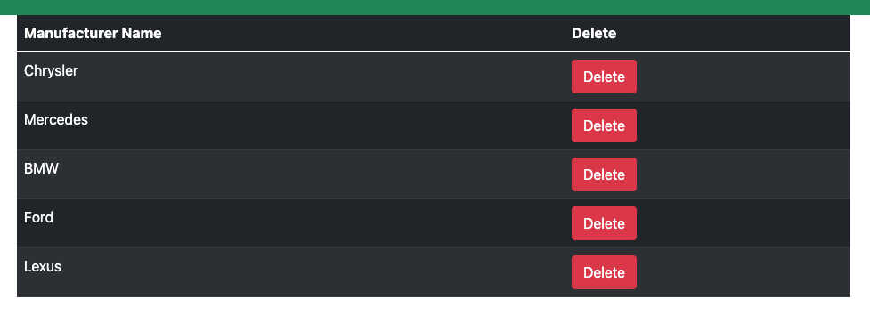

Create a Manufacturer:


List Models:

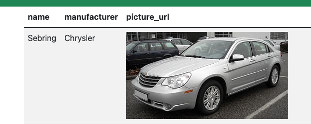

Create a Model:

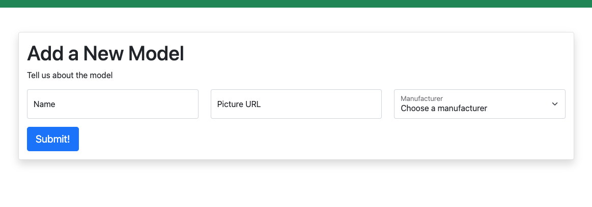

List Automobiles:

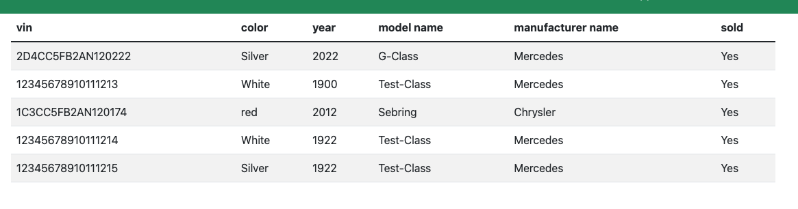

Create an Automobile:

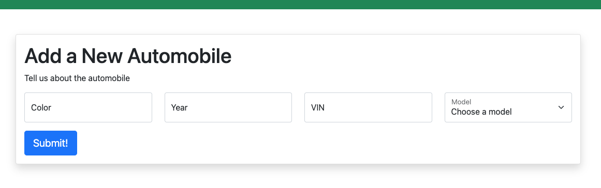


### Service API
 - Thanks for checking out the application!
 The Service microservice deals with all the logistics of bringing in your car to the dealership for repairs or maintenance.
Vehicles sold by this dealership will be tracked as VIP and will get special amenities! Amenities include a prioritized allocation of new brand new models with minimal Adjusted Dealer Markups.

The Service API lies in the url pattern http://localhost:8080/api/ and manages technicians and services.

### Technicians
Use this format to interact with Technicians:
| Action | Method | URL
| ----------- | ----------- | ----------- |
| List technicians | GET | http://localhost:8080/api/technicians/
| Technician detail | GET | http://localhost:8080/api/technicians/<int:pk>/
| Create a technician | POST | http://localhost:8080/api/technicians/
| Delete a technician | DELETE | http://localhost:8080/api/technicians/<int:pk>/

LIST TECHNICIANS: Sending a GET request to this endpoint will return a list of all existing technicians. Example below:

```
http://localhost:8080/api/technicians/
Example:
{
	"technicians": [
		{
			"first_name": "John",
			"last_name": "Doe",
			"employee_id": "1",
			"id": 1
		},
    ]
}
```

TECHNICIAN DETAIL: Sending a GET request to this endpoint will return a detailed view of all a technician by id. Example below:

```
http://localhost:8080/api/technicians/4/
Example:
{
	"first_name": "John",
	"last_name": "Doe",
	"employee_id": "1",
	"id": 1
}
```
CREATE A TECHNICIAN: Sending a POST request to this endpoint will create a technician with the necessary information. "id" is automatically generated in the database. Verify this is working by sending a GET request to LIST TECHNICIANS. Example below:

```
http://localhost:8080/api/technicians/1/
Example input:
{
	"first_name": "New",
	"last_name": "Technician",
	"employee_id": "2"
}
Example Output:
{
	"first_name": "New",
	"last_name": "Technician",
	"employee_id": "2",
	"id": 2
}

```
DELETE A TECHNICAN: Sending a DELETE request to this endpoint will delete an existing technician. Use id=<int:pk> to specify which technician.
http://localhost:8080/api/technicians/<int:pk>/

Make sure your data inputs match the above examples or else you will get errors.


### Service Appointments
Note: date_time fields MUST be in this format: "2023-04-20T14:39:00+00:00".
| Action | Method | URL
| ----------- | ----------- | ----------- |
| List service appointments | GET | http://localhost:8080/api/serviceappointments/
| Service appointment detail | GET | http://localhost:8080/api/serviceappointments/<int:id>/
| Create service appointment | POST | http://localhost:8080/api/serviceappointments/
| Delete service appointment | DELETE | http://localhost:8080/api/serviceappointments/<int:id>/

LIST SERVICE APPOINTMENTS: Sending a GET request to this endpoint will return a list of all existing service appointments. Example below:
```
http://localhost:8080/api/serviceappointment/
{
	"appointments": [
		{
			"date_time": "2023-04-20T14:39:00+00:00",
			"reason": "broken glass. everywhere.",
			"status": "finished",
			"vin": "2222",
			"customer": "Warren Longmire",
			"technician": {
				"first_name": "John",
				"last_name": "Doe",
				"employee_id": "69",
				"id": 7
			},
			"vip": false,
			"id": 1
		},
    ]
}
```
SERVICE APPOINTMENT DETAIL: Sending a GET request to this endpoint will return information of a specific service appointment. Example below:
```
http://localhost:8080/api/serviceappointments/<int:id>/
http://localhost:8080/api/serviceappointment/6/
{
	"date_time": "2023-04-20T14:39:00+00:00",
	"reason": "smells like w33d bruh ",
	"status": "canceled",
	"vin": "420",
	"customer": "CUSTOMER NAME HERE",
	"technician": {
		"first_name": "John",
		"last_name": "Doe",
		"employee_id": "69",
		"id": 7
	},
	"vip": false,
	"id": 6
}
```
SERVICE APPOINTMENT HISTORY can be viewed on the React portion of the front end application: http://localhost:3000/appointments/history
Here you will be able to see a list of ALL service appointments with ALL statuses. You are also able to filter/search service appointments by VIN.


CREATE SERVICE APPOINTMENT: Sending a POST request to this endpoint will create a new service appointment. Example below:
Note: technician is specified by "employee_id", NOT the auto generated "id". See example below

```
Input:
{
	"date_time": "2022-07-25T14:39:00.000Z",
	"reason": "making new appointment",
	"vin": "1234",
	"customer": "Random customer name",
	"technician": "2"
}

Output:
{
	"date_time": "2022-07-25T14:39:00.000Z",
	"reason": "making new appointment",
	"status": "IN_PROGRESS_STATUS",
	"vin": "1234",
	"customer": "Random customer name",
	"technician": {
		"first_name": "John",
		"last_name": "Doe",
		"employee_id": "2",
		"id": 4
	},
	"vip": false,
	"id": 39
}
```

DELETE SERVICE APPOINTMENT: Sending a DELETE request to http://localhost:8080/api/serviceappointments/<int:id>/ will delete the specified service appointment. For example, if we wanted to delete the previously created service appointment above we would use 39-<int:id> at the end of the url to do so.

Thanks for reading!
********************************************************************

### Sales API

The Sales API allows the user to view lists and create objects.

The Customers View

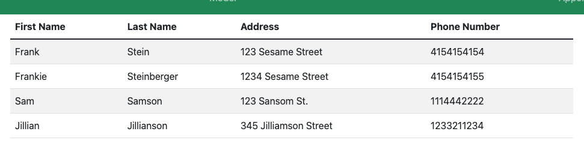

Add a Customer

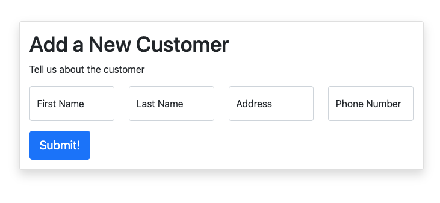

The Salespeople View

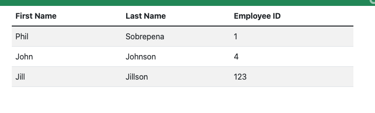

Add a Salesperson

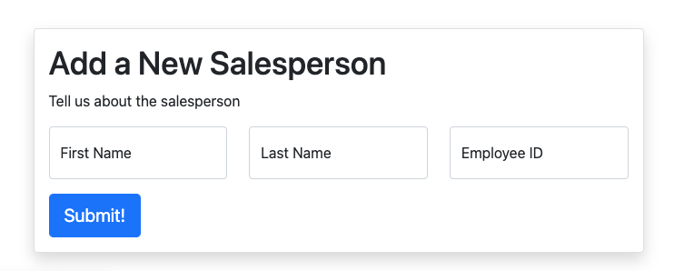

The Sales View

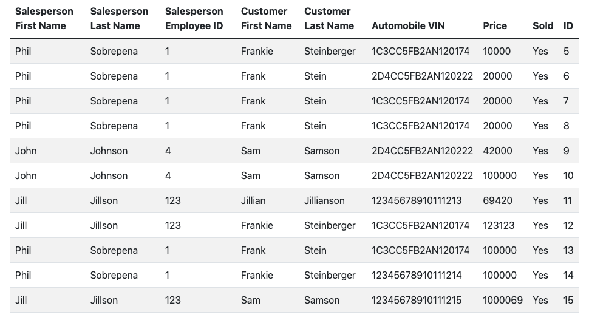

Sales by Salesperson View

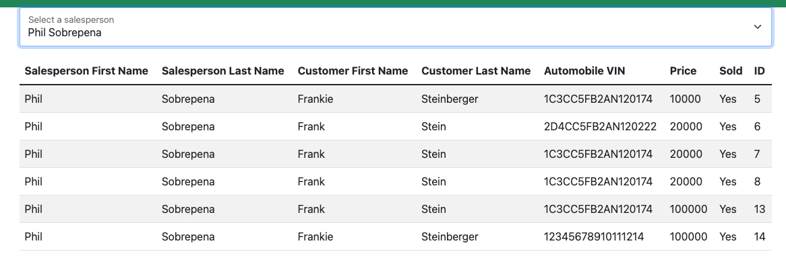

Add a Sale

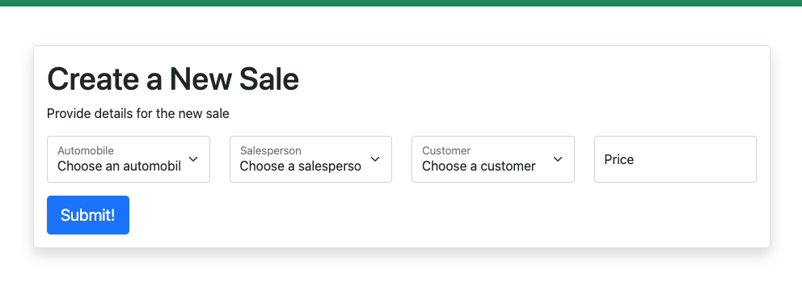


Endpoints for GET | POST | DELETE :

**NOTE** delete requests require "/<id>" added to the end of the request path.

customers:
http://localhost:8090/api/customers/

below is an example for a customer POST request (create a customer) with the proper json format:

{
	"first_name": "Frankie",
	"last_name": "Steinberger",
	"address": "1234 Sesame Street",
	"phone_number": "4154154155"
}

here is an example of a customer GET response with the proper json format:

{
	"customers": [
		{
			"first_name": "Frank",
			"last_name": "Stein",
			"address": "123 Sesame Street",
			"phone_number": "4154154154",
			"id": 1
		},
		{
			"first_name": "Frankie",
			"last_name": "Steinberger",
			"address": "1234 Sesame Street",
			"phone_number": "4154154155",
			"id": 3
		}
	]
}

salespeople:
http://localhost:8090/api/salespeople/

below is an example for a salespeople POST request (create a salesperson) with the proper json format:

{
	"first_name": "Frank",
	"last_name": "Stein",
	"employee_id": "2"
}

here is an example for a salepeople GET response with the proper json format:

{
	"salespeople": [
		{
			"id": 1,
			"first_name": "Phil",
			"last_name": "Sobrepena",
			"employee_id": 1
		},
		{
			"id": 3,
			"first_name": "John",
			"last_name": "Johnson",
			"employee_id": 4
		},
		{
			"id": 4,
			"first_name": "Jill",
			"last_name": "Jillson",
			"employee_id": 123
		}
	]
}

sales:
http://localhost:8090/api/sales/

below is an example for a sales POST request (create a sale) with the proper json format:

{
	"automobile": "1C3CC5FB2AN120174",
	"salesperson": 1,
	"customer": 3,
	"price": "10000"
}

here is an example of a sales GET response with the proper json format:
{
	"sales": [
		{
			"automobile": {
				"vin": "1C3CC5FB2AN120174",
				"sold": true
			},
			"salesperson": {
				"first_name": "Phil",
				"last_name": "Sobrepena",
				"employee_id": 1
			},
			"customer": {
				"first_name": "Frankie",
				"last_name": "Steinberger",
				"address": "1234 Sesame Street",
				"phone_number": "4154154155",
				"id": 3
			},
			"price": 10000,
			"id": 5
		},
		{
			"automobile": {
				"vin": "2D4CC5FB2AN120222",
				"sold": true
			},
			"salesperson": {
				"first_name": "Phil",
				"last_name": "Sobrepena",
				"employee_id": 1
			},
			"customer": {
				"first_name": "Frank",
				"last_name": "Stein",
				"address": "123 Sesame Street",
				"phone_number": "4154154154",
				"id": 1
			},
			"price": 20000,
			"id": 6
		}
	]
}


In order for a sale to be made, there need to be instances of the following models already created in the database:

Automobile
Customer
Salesperson

Without this data the sale form cannot be properly submitted.

the sale model uses foreignkey relationships to the respective models and utilizes a dropdown menu populated off of the existing id numbers created for the instances of salesperson and customer. The VIN number is a unique idenitifier that is used to access a particular vehicle in the inventory.


**SERVICES VALUE OBJECT**
The services microservice has 3 models: Technician, AutomobileVO, Appointment, The Value Object in the Services Microservice is AutomobileVO, which uses a poller to get automobile data from the Inventory.

The services poller automatically polls the inventory microservice every 60 seconds for data to ensure all data is updated.

**SALES VALUE OBJECT**
The Value Object in the Sales Microservice is the AutomobileVO, which uses a poller to get automobile data from the Inventory.

This integration is key in allowing sales to access existing unsold vehicles in the inventory.
